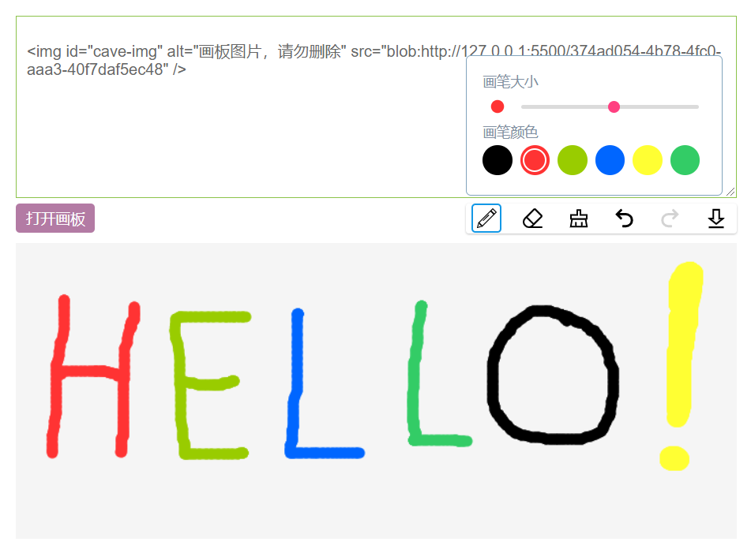
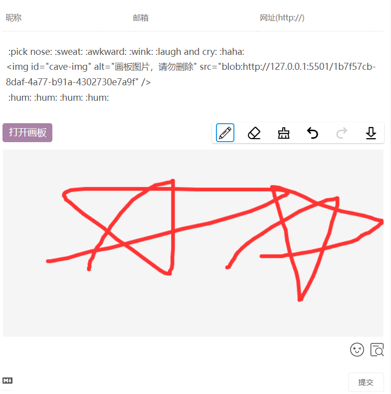
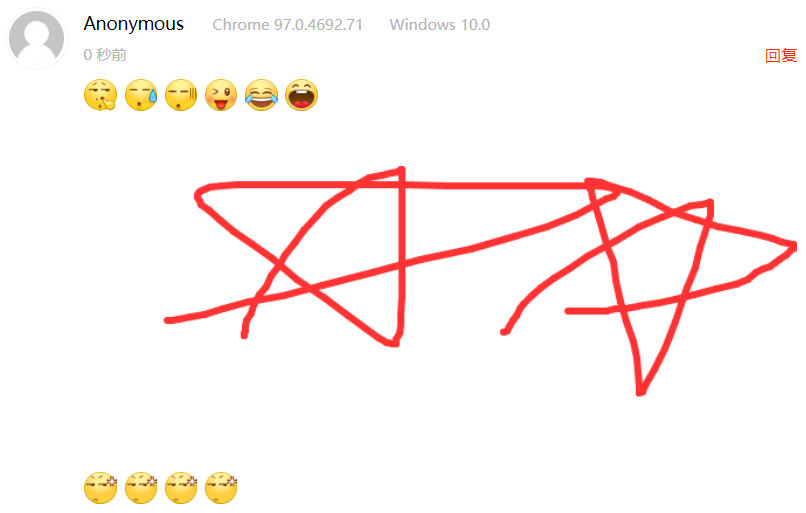

### 为你的评论表单添加一个画图板



### 在线体验：

Valine: [https://flatblowfish.github.io/cave-draw](https://flatblowfish.github.io/cave-draw) 。

WordPress: [https://blog.maplesugar.top/cave-draw](https://blog.maplesugar.top/cave-draw) 。

### 待做

在未来几个版本中，将实现下述功能：

- 按钮可配置
- 背景色，油漆桶，形状支持
- 对特定评论系统的支持转为插件形式

### 逻辑

一种插入到评论框中的是blob格式的图片，在提交的时候，转为base64格式的图片。

一种插入到评论框中的是base64格式的图片。**base64格式的图片内容太长了，在图片上下添加其他评论内容比较麻烦。**

```html
评论测试，评论测试，评论测试，评论测试，评论测试，评论测试

评论测试，评论测试，评论测试，评论测试，评论测试，评论测试
```

```html

```

### 使用方法

1.引入js。

```html
<script src="https://cdn.jsdelivr.net/gh/flatblowfish/cave-draw/dist/cave-draw.min.js"></script>
```

2.初始化配置。

```js
new CaveDraw({
    // 评论表单的 textarea 元素, 画图板插入到它下面
    ele: '#comment',
    // 评论表单的 form 元素，用来在提交时生成 base64 格式的图片
    // 如果评论系统没有 form 元素，则不写或者留空。此时，
    // 相应的，会直接把 base64 格式的图片插入到评论表单的 textarea 元素
    formEle: '#commentform',
    // 指定特殊的评论系统，目前只弄了valine
    special: 'valine',
    // 画图板的打开按钮
    openBtn: {
        style: 'background-color:#b37ba4;color:white;',
        hoverStyle: 'background-color: #49d0c0;'
    },
    // 画图板的 canvas 元素
    canvasStyle: 'cursor:crosshair;background:whitesmoke;/*margin-bottom:5px;border-radius:0px;*/'
})
```

### 示例1-WordPress

1.`functions.php`中设置允许提交base64格式的图片。

```php
/*
 * 评论框中，允许提交  格式的图片
 * 注意需要设置允许 data 协议
*/
function add_allowed_html_tags() {
    global $allowedtags;
    $allowedtags['img'] = array(
        'src' => true,
        'alt' => true,
        'id' => true
    );
}
add_action('init', 'add_allowed_html_tags', 10);
add_filter('kses_allowed_protocols', function ($protocols) {
    $protocols[] = 'data';
    return $protocols;
});
```

2.配置CaveDraw。

```js
new CaveDraw({
	ele: '#comment',
	formEle: '#commentform',
	openBtn: {
		style: 'background-color:#b37ba4;color:white;',
		hoverStyle: 'background-color: #49d0c0;'
	},
	canvasStyle: 'cursor:crosshair;background:whitesmoke;/*margin-bottom:5px;border-radius:0px;*/'
})
```

### 示例2-Valine

1.允许提交base64格式的图片。在`Valine.min.js`搜索`allowedSchemes.some(`，可以找到valine对于评论字段过滤的函数，在这个函数最开始添加`if("data:image/"==e.substr(0,11))return true;`。

在`valine-modify`文件夹中，已经有弄好的`Valine.min.js`，版本为`1.4.18`。

```js
function l(e) {
    if ("data:image/" == e.substr(0, 11)) return true;
    function t(t) {
    return 0 === e.indexOf(t + ":")
    }
    var n = e[0];
    if ("#" === n || "/" === n) return !0;
    var r = e.indexOf(":");
    if (-1 === r) return !0;
    var i = e.indexOf("?");
    if (-1 !== i && r > i) return !0;
    var o = e.indexOf("#");
    return -1 !== o && r > o || v.allowedSchemes.some(t)
}
```

2.配置CaveDraw，注意：**由于对valine的submit按钮的click事件进行了拦截，所以，CaveDraw 初始化要在valine前面**。

```html
<style>
    .brush-detail p {
        line-height: 1em!important;
    }
    .v[data-class="v"] .veditor {
        max-height: 17em;
    }
</style>
<script>
// 由于对valine的submit按钮的click事件进行了拦截，所以，CaveDraw 初始化要在valine前面
new CaveDraw({
	// 评论表单的 textarea 元素, 画图板插入到它下面
	ele: '#veditor',
	// 指定特殊的评论系统，目前只弄了valine
	special: 'valine',
	// 画图板的打开按钮
	openBtn: {
		style: 'background-color:#b37ba4;color:white;',
		hoverStyle: 'background-color: #49d0c0;'
	},
	// 画图板的 canvas 元素
	canvasStyle: 'cursor:crosshair;background:whitesmoke;/*margin-bottom:5px;border-radius:0px;*/'
})

var valine = new Valine();
valine.init({
	el: '.comment',
	app_id: '',
	app_key: '',
	placeholder: 'ヾﾉ≧∀≦)o来啊，快活啊!',
	path: window.location.pathname,
	avatar:'mm', // 1.1.7 新增(mm/identicon/monsterid/wavatar/retro)
	// guest_info: ['nick'] // 默认 ['nick', 'mail', 'link']
});
</script>
```

效果：





### 示例3-其他

没有form的表单，也没有被作者特殊照顾的评论系统，可以直接把base64格式图片插入评论框。

```html
<style>
    /* 设置评论框最大高度，因为base64格式图片太长 */
    #comment {
        max-height: 300px;
    }
</style>
<script>
new CaveDraw({
    // 评论表单的 textarea 元素, 画图板插入到它下面
    ele: '#comment',
    // 评论表单的 form 元素，用来在提交时生成 base64 格式的图片
    // 如果评论系统没有 form 元素，则不写或者留空。此时，
    // 相应的，会直接把 base64 格式的图片插入到评论表单的 textarea 元素
    // formEle: '#commentform',
    // 画图板的打开按钮
    openBtn: {
        style: 'background-color:#b37ba4;color:white;',
        hoverStyle: 'background-color: #49d0c0;'
    },
    // 画图板的 canvas 元素
    canvasStyle: 'cursor:crosshair;background:whitesmoke;/*margin-bottom:5px;border-radius:0px;*/'
})
</script>
```

